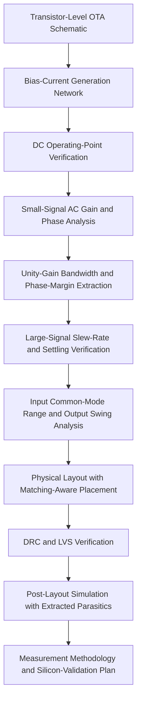

02_Cadence_CMOS_OTA_Design/README.md

# Project Overview:
This project presents a complete full-custom CMOS Operational Transconductance Amplifier (OTA) design using Cadence Virtuoso. The design follows an analog IC workflow from transistor-level schematic design to simulation, physical layout, DRC/LVS verification, full-circuit integration, and post-layout validation.
The OTA is implemented as a single-stage symmetrical current-mirror OTA in a 180 nm-class 2 V CMOS process. The design includes a differential input pair, PMOS current-mirror loads, NMOS output mirrors, a tail current source, and a dedicated bias-current generation network.
This project demonstrates practical analog/RF IC design capability, including schematic-level analysis, operating-point verification, large-signal transient behaviour, layout-aware design, verification sign-off, and measurement-aware silicon-validation planning.

# Objective:
The objective of this project was to design and verify a stable CMOS OTA suitable for analog and mixed-signal applications. The design goal was to realize a single-stage OTA with sufficient DC gain, unity-gain bandwidth in the tens of MHz range, stable closed-loop behaviour, and a physical layout that passes DRC/LVS verification.

# The project focuses on:
•	Transistor-level CMOS OTA design
•	Bias-current generation
•	Small-signal gain and phase analysis
•	Unity-gain bandwidth and phase-margin verification
•	DC operating-point validation
•	Slew-rate and settling-time analysis
•	Input common-mode range and output swing characterization
•	Matching-aware physical layout
•	DRC/LVS verification
•	Post-layout parasitic-aware validation
•	Measurement methodology for silicon validation

# Repository Structure:

```text
02_Cadence_CMOS_OTA_Design/
│
├── README.md
│
├── docs/
│   └── CMOS_OTA_Design_Cadence_Virtuoso_Report.pdf
│
├── figures/
│   ├── schematic/
│   ├── ac_analysis/
│   ├── dc_operating_point/
│   ├── transient/
│   ├── common_mode_output_swing/
│   ├── layout/
│   ├── drc_lvs/
│   └── post_layout/
│
├── schematics/
│   └── screenshots/
│
├── layout/
│   └── screenshots/
│
├── simulation_results/
│   ├── ac_response/
│   ├── dc_operating_point/
│   ├── slew_settling/
│   ├── common_mode_range/
│   └── post_layout/
│
├── verification/
│   ├── drc/
│   └── lvs/
│
└── notes/
    ├── measurement_methodology.md
    └── result_traceability.md
```

# Design Flow:


# OTA Architecture:
The OTA core is based on a symmetrical current-mirror topology. The input differential pair converts the differential input voltage into a current imbalance. The current-mirror loads and output mirrors steer this current imbalance to produce a single-ended output response.

The ideal small-signal OTA relation is:
$$
i_{out}=g_m(v_+ - v_-)
$$

The first-order DC gain is approximated by:

$$
A_0 \approx g_{m,eff}R_{out}
$$
where (g_{m,eff}) is the effective transconductance and (R_{out}) is the output resistance at the output node.

For a current-mirror OTA, the effective transconductance can be approximated as:

$$
g_{m,eff}=B g_{m1}
$$

where (B) is the mirror current-scaling factor and (g_{m1}) is the input-pair transconductance.

The unity-gain bandwidth is approximately:

$$
f_u \approx \frac{B g_{m1}}{2\pi C_L}
$$

The dominant output pole is:

$$
f_{p1} \approx \frac{1}{2\pi R_{out}C_L}
$$

---

# Key Results:

| Parameter              |              Result | Interpretation                                         |
| ---------------------- | ------------------: | ------------------------------------------------------ |
| DC gain                |          ≈ 24.85 dB | Open-loop low-frequency gain                           |
| Unity-gain bandwidth   |          ≈ 14.6 MHz | Frequency where gain crosses 0 dB                      |
| Phase at unity gain    |           ≈ −106.7° | Phase marker at unity-gain frequency                   |
| Phase margin           |               ≈ 73° | Stable unity-gain feedback behaviour                   |
| Slew rate              |         ≈ 15.7 V/µs | Large-signal rising-edge slope                         |
| DRC                    |        0 violations | Layout satisfies design-rule checks                    |
| LVS                    |        0 mismatches | Layout matches schematic connectivity                  |
| Post-layout validation | Meets design intent | Extracted-layout simulation confirms performance trend |

---

# Small-Signal AC Analysis:

Small-signal AC analysis verifies open-loop gain, bandwidth, and stability. The OTA was simulated with a small-signal differential input while the DC operating point was fixed.

The phase margin is calculated as:

$$
PM = 180^\circ + \angle A(f_u)
$$

Using the measured phase at unity-gain bandwidth:

$$
PM \approx 180^\circ - 106.7^\circ \approx 73^\circ
$$

A phase margin of approximately 73° indicates stable and well-damped unity-gain feedback behaviour.

---

# DC Operating-Point Verification:

DC operating-point analysis verifies that the input pair, current mirrors, tail current source, and output branch are correctly biased.

For reliable small-signal operation, active MOS devices should remain in saturation.

For NMOS devices:

$$
V_{DS} \geq V_{ov}, \qquad V_{ov}=V_{GS}-V_{th}
$$

For PMOS devices:

$$
V_{SD} \geq V_{ov}, \qquad V_{ov}=V_{SG}-|V_{th}|
$$

The operating point was checked using device currents, node voltages, (g_m), (r_o), and device-region information.

---

# Transient Slew-Rate and Settling Verification:

Transient analysis verifies the large-signal response of the OTA. The slew rate is determined by the current available to charge or discharge the effective load capacitance:

$$
SR=\max\left(\frac{dV_{out}}{dt}\right)
$$

The observed rising slew rate was approximately:

$$
SR \approx 15.7~V/\mu s
$$

The settling response showed stable behaviour without strong overshoot or ringing, which is consistent with the approximately 73° phase margin observed in AC analysis.

---

##  Common-Mode Range and Output Swing:

The input common-mode range defines the input voltage range where the differential pair and bias devices remain correctly biased. The output swing defines the range where the output branch remains in saturation and the OTA output remains useful.

For the NMOS input pair, the lower input common-mode limit is related to the input-pair and tail-source headroom. The upper limit is constrained by the PMOS load and input-pair saturation condition.

Output swing is bounded by the output-branch saturation margins. This characterization is important because gain and bandwidth are meaningful only inside the valid input and output operating range.

---

## Layout, DRC, and LVS Verification:

The physical layout was created using matching-aware analog layout techniques:

* Symmetric device placement
* Matched device arrays
* Dummy devices
* Carefully routed supply and ground rails
* Layout-aware bias network integration
* DRC verification
* LVS verification

DRC confirms that the layout satisfies process design rules. LVS confirms that the extracted layout netlist matches the original schematic. A clean DRC/LVS result makes this project stronger than a schematic-only simulation project.

---

##  Post-Layout Validation:

Post-layout validation uses the extracted layout netlist, including parasitic resistance and capacitance, to verify that physical implementation does not significantly degrade schematic-level performance.

The post-layout simulation confirms that the OTA maintains the intended gain, bandwidth, phase behaviour, and transient response trend after layout parasitics are included.

---

## Measurement Methodology:

Although this project was completed at the simulation and layout stage and the OTA was not physically fabricated, each simulated result has a direct measurement counterpart.

| Simulated Analysis                 | Bench Instrument                                                          | Measurement Method                                                     |
| ---------------------------------- | ------------------------------------------------------------------------- | ---------------------------------------------------------------------- |
| AC gain, bandwidth, and phase      | Frequency-response analyzer / network analyzer / oscilloscope-based setup | Small-signal sweep to extract gain, bandwidth, and phase               |
| DC operating point                 | SMU / DC source-meter                                                     | Bias current, node voltage, (V_{GS}), and (V_{DS}) verification        |
| Slew rate and settling             | Digital oscilloscope                                                      | Step-response measurement, (dV/dt), settling time, and overshoot check |
| Common-mode range and output swing | SMU + oscilloscope                                                        | DC sweep to identify valid input/output operating range                |
| Linearity                          | Signal generator + spectrum analyzer                                      | Harmonic distortion, IM3, and IP3 estimation                           |
| Noise                              | Spectrum analyzer + low-noise preamplifier                                | Output-noise measurement and input-referred noise calculation          |

This measurement plan connects Cadence simulation results to real silicon-validation methodology.

---

## Skills Demonstrated:

This project demonstrates practical capability in:

* CMOS analog IC design
* OTA architecture and current-mirror design
* Transistor biasing and operating-point analysis
* Small-signal gain and bandwidth analysis
* Phase-margin and stability interpretation
* Slew-rate and settling-time verification
* Common-mode range and output swing characterization
* Matching-aware physical layout
* Dummy-device usage and layout symmetry
* DRC/LVS verification
* Post-layout parasitic-aware validation
* Technical report writing and result interpretation
* Measurement-aware analog/RF validation planning

---

# Key Results :
| Parameter              |              Result | Interpretation                                                      |
| ---------------------- | ------------------: | ------------------------------------------------------------------- |
| DC gain                |          ≈ 24.85 dB | Open-loop low-frequency gain                                        |
| Unity-gain bandwidth   |          ≈ 14.6 MHz | Frequency where the open-loop gain crosses 0 dB                     |
| Phase at unity gain    |           ≈ −106.7° | Phase value at the unity-gain frequency                             |
| Phase margin           |               ≈ 73° | Indicates stable unity-gain feedback behaviour                      |
| Slew rate              |         ≈ 15.7 V/µs | Large-signal rising-edge slope from transient response              |
| DRC                    |        0 violations | Layout satisfies design-rule checks                                 |
| LVS                    |        0 mismatches | Layout matches schematic connectivity                               |
| Post-layout validation | Meets design intent | Extracted-layout simulation confirms the expected performance trend |

# Common-Mode Range and Output Swing:
The OTA was characterized for input common-mode range and output swing to identify the valid operating region. This ensures that gain, bandwidth, and transient performance are interpreted only within the voltage range where the transistors remain correctly biased.

# Layout, DRC, and LVS Verification:
The OTA layout was implemented using matching-aware analog layout techniques, including symmetric placement, dummy devices, and careful routing. The design passed DRC with 0 violations and LVS with 0 mismatches, confirming both manufacturability and schematic-layout equivalence.

# Post-Layout Validation:
Post-layout simulation was performed using the extracted layout netlist to check the effect of parasitic resistance and capacitance. The extracted simulation confirmed that the layout parasitics did not invalidate the intended gain, bandwidth, stability, and transient performance trend.

# Measurement Methodology:
Although the OTA was not fabricated, the report maps each simulated result to a practical bench-measurement method. AC gain and phase can be validated using a frequency-response setup, DC bias using an SMU, slew and settling using an oscilloscope, and noise/linearity using spectrum-analysis-based methods

# Result Traceability:
This project separates results into three categories so that the report remains technically clear and defensible.
 Cadence Marker / Plot Values
These are values directly visible from Cadence simulation plots or annotated screenshots.
Examples:
•	DC gain: approximately 24.85 dB
•	Unity-gain bandwidth: approximately 14.6 MHz
•	Phase at unity-gain frequency: approximately −106.7°
•	Phase margin: approximately 73°
•	Slew rate: approximately 15.7 V/µs
•	DRC: 0 violations
•	LVS: 0 mismatches

# Analytical / Hand-Calculated Values:
These are values derived from analog IC equations and operating-point interpretation.
Examples:
•	Effective transconductance
•	Output resistance estimate
•	Effective load-capacitance estimate from bandwidth
•	Effective load-capacitance estimate from slew rate
•	Saturation-region checks
•	Dominant-pole interpretation
 
# Engineering Interpretations:
These are conclusions based on simulation results, circuit theory, and layout verification.
Examples:
•	The OTA is stable for unity-gain feedback based on the measured phase margin.
•	The transient response is consistent with the AC stability result.
•	The layout is stronger than a schematic-only project because DRC and LVS are clean.
•	The post-layout result confirms that extracted parasitics do not invalidate the intended design trend.

# Important Note:
The OTA was not physically fabricated. Therefore, the results represent Cadence schematic simulation, layout verification, and post-layout validation, not measured silicon data.

# Skills Demonstrated: 
This project demonstrates practical capability in:
•	CMOS analog IC design
•	OTA architecture and current-mirror design
•	Transistor biasing and operating-point analysis
•	Small-signal gain and bandwidth analysis
•	Phase-margin and stability interpretation
•	Slew-rate and settling-time verification
•	Common-mode range and output swing characterization
•	Matching-aware physical layout
•	Dummy-device usage and layout symmetry
•	DRC/LVS verification
•	Post-layout parasitic-aware validation
•	Technical report writing and result interpretation
•	Measurement-aware analog/RF validation planning

# Project Status:
Status: Completed
Tool: Cadence Virtuoso
Project Type: Analog/RF IC Design Portfolio
Main Focus: CMOS OTA design, schematic simulation, layout, DRC/LVS, post-layout validation, and measurement methodology

# Author:
Md Moklesur Rahman
RF / Wireless / System Specification Engineer
LinkedIn:
linkedin.com/in/md-moklesur-rahman-65a63962
